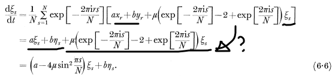

# Turing on Turing Patterns - Chapter 6: Ring of Cells in Discrete and Continuous Form

> Ring-a-Ring o' roses  
> A pocket full of noises  
> Reacting, Diffusing ...  
> The strong mode shows  

终于进入了作为工程师的我最期待的用傅里叶分析描述形态素发展的的起始章节了。虽说我是号称很熟悉傅里叶分析，但是实际上真的深入去探索背后的数学细节，却也发现了很多当年学过，但好久不用就忘记的重要的基本性质。以下是一些重要的节点的笔记。

# 数学模型的设计思路——线性化和离散化

图灵在第六章开头说明了选取一个细胞环(ring of cell)研究，以及将研究的时间点仍然放在稳态刚刚被打破的那一个时刻的“小信号模型”的处理的原因：
1. 数学上，小信号模型可以将一个复杂的非线性函数“线性化”，由此我们可以利用线性代数的工具去进行更细致的分析。非线性函数将使得分析变得过于复杂。
2. 稳态刚刚打破的那个时间点也是非常重要的时间点，因为那个时间点决定了之后的发展走向。

# 细胞环的扩散-反应方程建模

## 细胞环的离散化和周期性边界条件

图灵假定了一个细胞环的模型。这个模型中有N个细胞以环状的形式互相“连接”。形态素的扩散只会发生在相邻的两个细胞之中。由此，图灵写出了如下的扩散-反应方程组：
$$
\left.
\begin{aligned}
\frac{\text{d}X_r}{\text{d}t} &= f(X_r, Y_r) + \mu(X_{r+1} - 2X_r + X_{r-1}) \\
\frac{\text{d}Y_r}{\text{d}t} &= g(X_r, Y_r) + \nu(Y_{r+1} - 2Y_r + Y_{r-1})
\end{aligned}
\right\} \quad (r = 1, \dots, N).
$$
这个方程组的各项解释如下：
- **$\frac{\text{d}X_r}{\text{d}t}$**: 第 $r$ 个细胞中化学物质 $X$ 的浓度随时间的变化率。
- **$f(X_r, Y_r)$ / $g(X_r, Y_r)$**: **反应项（Reaction）**，描述单元内部化学物质的相互作用。图灵假设它是一个“本地化”的，但是可能是非线性的项。
- **$\mu, \nu$**: 扩散系数。
- **$(X_{r+1} - 2X_r + X_{r-1})$**: **离散拉普拉斯算子**。这正是描述“扩散”到相邻细胞（$r-1$ 和 $r+1$）的数学表达。我想到以前学习数字图像处理(Digital image processing)的时候，有一个重要的算子就是拉普拉斯算子，它的一维形式正是$[1, -2, 1]$。
- **$N$**: 环中细胞的总数。

当你盯着扩散项看的时候，你可能还会有疑虑：我们只有N个细胞。第N个细胞要扩散到第N+1个细胞中，可是它并不存在啊？这里你就理解为什么图灵要设计一个“环”了，第N个细胞会和第一个细胞连接，所以扩散项会回到第一个细胞。也就是说，图灵利用环的结构设计了一个周期性的边界条件。

## 在平衡态附近的线性化 —— 小信号模型

前面一节设计的反应关系$f(X,Y)$ 和 $g(X,Y)$ 是一个很通用的函数，它只是告诉我们反应速率只和本地的X和Y的浓度有关系，但是这个关系可能可以非常复杂。如果停止于此，那么就很难继续分析了。为此，图灵进一步提出了“线性化”这两个函数。对于学习过电子工程的我来说，有一个更熟悉的名称——小信号模型。

图灵得到的小信号模型如下：
$$
\left.
\begin{aligned}
\frac{\text{d}x_r}{\text{d}t} &= ax_r + by_r + \mu(x_{r+1} - 2x_r + x_{r-1}), \\
\frac{\text{d}y_r}{\text{d}t} &= cx_r + dy_r + \nu(y_{r+1} - 2y_r + y_{r-1}).
\end{aligned}
\right\}
$$
图灵是如何通过线性化得到上述公式的呢？ 这里我稍微展开一下过程：

这里你会注意到，之前的大写的 X, Y 变成了小写的 x, y 。这一转化表示它的“小信号”模型本质——小写的x 和 y表示它们是偏离于平衡态 $h, k$ 的一种微小的扰动。所以两者的关系可以这么写：
$$
\left.  
\begin{aligned}  
X_r = x_r + k \\ 
Y_r = y_r + h 
\end{aligned}  
\right.
$$
而且，由于图灵设置了这个“扰动”是处在平衡态的，因此，反应速率在平衡态应该是0，而且平衡态的时候，所有位置的浓度都是一样的。这也是为什么 $k,h$ 两者都没有表示位置的下标：
$$
\left.  
\begin{aligned}  
f(k, h) = 0 \\
g(k, h) = 0 
\end{aligned}  
\right.
$$
现在，如果我们要研究 $X_r, Y_r$ 的反应速率，我们可以通过泰勒展开保留线性项的方法得到。以$f$ 这个函数的展开为例子：
$$
\left.  
\begin{aligned}  
f(X_r, Y_r) &= f(k+x_r, h+y_r) \\
		&=f(k, h) + x_r \frac{\partial f}{\partial x} (k,h) + y_r \frac{\partial f}{\partial y} (k,h) \\
		&= x_r \frac{\partial f}{\partial x} (k,h) + y_r \frac{\partial f}{\partial y} (k,h) \\
		&=a x_r + b y_r
\end{aligned}  
\right.
$$
这里我们看到稳态的好处了，这个时间点我们可以去掉那个DC的项： $f(k,h)$ 大大简化了分析过程。
# 细胞环的扩散-反应方程的求解

## 离散傅里叶变换

现阶段终于得到了一组简单的一阶线性齐次微分方程。但是它的复杂度仍然是很恐怖的。以N=20，有20个细胞为例子，我们要面对的是40个联立的微分方程！这就相当于要解一个40元一次方程组，虽然很简单，但是极其耗费时间精力！

这时候的图灵终于拿出了第二章准备好的数学武器——傅里叶分析。更确切地说，他使用了离散傅里叶变换（Discrete Fourier Transform），虽然在文章中他并没有明确提到这个名字。

如果你学过信号和系统，你会记得在离散傅里叶变换中，时间域是“离散化”的。而且如果信号是周期性的化的，那么我们的频域信号也会是离散化的。实际上，[[快速傅里叶变换]] 正是离散傅里叶变换最高效的算法。不过在图灵这里，我们不是在时间轴上去做傅里叶变换的操作，而是在空间轴上去做。又由于图灵研究的对象是一个一维的环形，所以傅里叶变换的其他性质几乎不变。

对于第r个细胞的形态素浓度偏离值，图灵写出了如下的离散傅里叶变换：
$$
\left.
\begin{aligned}
x_r = \sum_{s=0}^{N-1} \exp \left[ \frac{2\pi irs}{N} \right] \xi_s, \\
y_r = \sum_{s=0}^{N-1} \exp \left[ \frac{2\pi irs}{N} \right] \eta_s.
\end{aligned}
\right\}
$$
这里的 $s$ 代表的就是“空间频率”。s越小，空间上的变化越慢，波纹也就越宽，s越大，则空间上的变化也就越快，波纹也就越“密”。而相应的 $\xi_s , \eta_s$  则是对应空间频率的系数。

## 离散傅里叶变换如何简化反应扩散方程？正交性+简化拉普拉斯算子

那么为什么离散傅里叶变换能够简化我们的问题呢？这个式子看上去让问题更复杂了呀！这就不得不提到傅里叶变换中的"核“的正交性，以及傅里叶变换后的结果对拉普拉斯算子的极大简化了。

以 $x_r$ 为例子，带入式子我们可以看看发生了什么。

不妨先看看扩散项简化成了什么：
$$
\begin{aligned}
& \mu(x_{r+1} - 2x_r + x_{r-1}) = \\ 
& \mu(\sum_{s=0}^{N-1} \exp \left[ \frac{2\pi i(r+1)s}{N} \right] \xi_s - 2\sum_{s=0}^{N-1} \exp \left[ \frac{2\pi irs}{N} \right] \xi_s + \sum_{s=0}^{N-1} \exp \left[ \frac{2\pi i(r+1)s}{N} \right] \xi_s) \\
& = \mu (e^{2\pi i s /N} + e^{-2\pi i s /N} -2) \sum_{s=0}^{N-1} \exp \left[ \frac{2\pi irs}{N} \right] \xi_s \\
& = \mu (2cos(2\pi s /N) - 2)\sum_{s=0}^{N-1} \exp \left[ \frac{2\pi irs}{N} \right] \xi_s \\
& = \mu (2 - 4sin^2(\pi s/N)  - 2)\sum_{s=0}^{N-1} \exp \left[ \frac{2\pi irs}{N} \right] \xi_s \\
& = -4\mu sin^2(\pi s/N) \sum_{s=0}^{N-1} \exp \left[ \frac{2\pi irs}{N} \right] \xi_s
\end{aligned}
$$

WOW! 我们的扩散项经过了这么一通变换（欧拉公式+倍角公式）竟然变成了一个相对简单的系数$-4\mu sin^2(\pi s/N)$ 。

不过我们的路还没走完，接下来看看剩下的部分：
$$
\begin{aligned}
& \frac{d}{dt}\sum_{s=0}^{N-1} \exp \left[ \frac{2\pi irs}{N} \right] \xi_s  \\ & =a\sum_{s=0}^{N-1} \exp \left[ \frac{2\pi irs}{N} \right] \xi_s + b\sum_{s=0}^{N-1} \exp \left[ \frac{2\pi irs}{N} \right] \eta_s -4\mu sin^2(\pi s/N) \sum_{s=0}^{N-1} \exp \left[ \frac{2\pi irs}{N} \right] \xi_s \\ 
 & =(a-4\mu sin^2(\pi s/N))\sum_{s=0}^{N-1}\exp \left[ \frac{2\pi irs}{N} \right] \xi_s +b\sum_{s=0}^{N-1} \exp \left[ \frac{2\pi irs}{N} \right] \eta_s \\
 &=\sum_{s=0}^{N-1}\exp \left[ \frac{2\pi irs}{N} \right] ((a-4\mu sin^2(\pi s/N))\xi_s +b\eta_s)
\end{aligned} 
$$

现在看起来似乎还是很复杂，这些求和符号实在是太讨厌了，但是好在左右两边的求和的傅里叶的kernel是一摸一样的。如果能就这么把这个求和符号和exponential给“约掉”就好了！

$$
\begin{aligned}
\sum_{s=0}^{N-1} \exp \left[ \frac{2\pi irs}{N} \right] \frac{d}{dt}\xi_s & = \sum_{s=0}^{N-1}\exp \left[ \frac{2\pi irs}{N} \right] ((a-4\mu sin^2(\pi s/N))\xi_s +b\eta_s)  \\
\\
& \text{HOW???} \rightarrow & \\
\\
\frac{d}{dt}\xi_s &=(a-4\mu sin^2(\pi s/N))\xi_s +b\eta_s
\end{aligned}
$$

答案是可以约掉！我们要利用傅里叶核的正交性了：
$$
\begin{aligned}
\sum_{s=0}^{N-1} \exp \left[ \frac{2\pi irs}{N} \right] &= 0 \quad \text{if} \quad 0 < r < N, \\
                                                     &= N \quad \text{if} \quad r = 0 \text{ or } r = N.
\end{aligned}
$$
图灵在这里并没有详细讲解怎么做到的，实际上这么久没有碰这部分的基础知识，我竟然面对这个简化迟疑了！我发现我有点忘记怎么做的了！实际上，我们要做的是在两边再加上一个求和！

以左边那一项为例子：
$$
\begin{aligned}
& \sum_{r=0}^{N-1} \exp \left[ \frac{-2\pi irk}{N} \right] \sum_{s=0}^{N-1} \exp \left[ \frac{2\pi irs}{N} \right] \frac{d}{dt}\xi_s  \\
& = \sum_{s=0}^{N-1}\sum_{r=0}^{N-1}\exp \left[ \frac{2\pi ir(s-k)}{N} \right]\frac{d}{dt}\xi_s \\
& = \sum_{s=0}^{N-1} N\delta(s-k) \frac{d}{dt}\xi_s \\
& =\frac{d}{dt}\xi_k
\end{aligned}
$$
我们可以用类似的推导规则简化右边半边的式子，以及另一个关于Y的式子。最终我们得到了如下的简化版本（将k重新换回s）：

$$
\begin{aligned}
\frac{d}{dt}\xi_s &= (a-4\mu sin^2(\pi s/N))\xi_s +b\eta_s \\
\frac{d}{dt}\eta_s &= c\xi_s +(d-4\nu sin^2(\pi s/N))\eta_s
\end{aligned}
$$
这里最最关键的就是之前耦合临近位置的扩散项通过频域的表示“解耦”了。现在这两个式子没有任何其他的耦合。我们只需要解一个二元的常微分方程组就可以了！我们不妨称这些被解耦后的方程组（不同的s）对应了不同的模式(mode)。模式可以理解为空间上的斑纹的形态。

在微分方程的世界里，二元的常微分方程组难度等于小学的二元一次方程。我们会在之后的章节去解析它的解法。
## 小插曲——另一个笔误？

在这里，我似乎发现了图灵的另一个小的笔误，出现在6.6这个式子中，也就是利用正交性简化求和式子的部分：

虽然最后的结果是对的，但是这个过程有一些不协调的地方出现第一行在扩散项那一部分，中括号里既有空间项系数$x_r,y_r$，也有频率项系数$\xi_s$ 这个让我觉得不太对。

仔细研究了图灵的计算方法以后，我发现他的做法和我的方法恰好反过来，他是通过逆傅里叶变换，将一系列关于x的式子乘上逆傅里叶变换核然后求和简化的。我觉得这里的问题可能在于第一行最后一个中括号放错了地方。以下是我认为的可能正确的推导过程：

$$
\begin{aligned}
\frac{\text{d}\xi_s}{\text{d}t} &= \frac{1}{N} \sum_{r=1}^{N} \exp \left[ -\frac{2\pi irs}{N} \right] \left[ ax_r + by_r\right] + \mu \left( \exp \left[ -\frac{2\pi is}{N} \right] - 2 + \exp \left[ \frac{2\pi is}{N} \right] \right) \xi_s  \\
&= a\xi_s + b\eta_s + \mu \left( \exp \left[ -\frac{2\pi is}{N} \right] - 2 + \exp \left[ \frac{2\pi is}{N} \right] \right) \xi_s \\
&= \left( a - 4\mu \sin^2 \frac{\pi s}{N} \right) \xi_s + b\eta_s. \qquad (6.6)
\end{aligned}
$$

顺着图灵的思路走完一遍以后，我发现，图灵的解法比我的更简洁，也更少弯弯绕。

## 线性常系数微分方程求解 —— 特征根再临！

如果我们还记得曾经推导过的[[20260124_斐波那契，等差数列和纳瓦尔]]，我们一定还对特征根有很深的印象。实际上，这里发生的事情几乎和斐波那契数列发生的事情是一样的。我们就来看看为何如此吧！

前面的微分方程组我们可以写成矩阵的格式：

$$\frac{d}{dt} \begin{pmatrix} \xi_s \\ \eta_s \end{pmatrix} = \begin{pmatrix} a - 4\mu \sin^2 \frac{\pi s}{N} & b \\ c & d - 4\nu \sin^2 \frac{\pi s}{N} \end{pmatrix} \begin{pmatrix} \xi_s \\ \eta_s \end{pmatrix}$$
右边这个矩阵对应的特征根方程我们也就很容易得到了 （$p$ 为特征根）：

$$
\left( p - a + 4\mu \sin^2 \frac{\pi s}{N} \right) \left( p - d + 4\nu \sin^2 \frac{\pi s}{N} \right) = bc
$$
### 特征根不同的情况
当我们看到右边的这个矩阵的时候,是不是有一种要求出它特征根的冲动? 不过在此之前,我们不妨想一想这里的特征根(以及特征向量构成的矩阵) 要如何帮助我们求解这个微分方程? 我们可以将这个矩阵对角化为$M=V\Lambda V^{-1}$ , 其中$V$ 是特征向量所组成的矩阵 , 而$\Lambda$ 则是对角线为特征值的对角矩阵. 

$$
\begin{aligned}
& \frac{d}{dt}\begin{pmatrix} \xi_s \\ \eta_s \end{pmatrix} = V\Lambda V^{-1} \begin{pmatrix} \xi_s \\ \eta_s \end{pmatrix} \\
& \frac{d}{dt}V^{-1}\begin{pmatrix} \xi_s \\ \eta_s \end{pmatrix} = \Lambda V^{-1}\begin{pmatrix} \xi_s \\ \eta_s \end{pmatrix} \\
& \frac{d}{dt}\begin{pmatrix} \xi'_s \\ \eta'_s \end{pmatrix} = \Lambda \begin{pmatrix} \xi'_s \\ \eta'_s \end{pmatrix}
\end{aligned}
$$
这里注意到我们把特征矩阵$V^{-1}$ 吸收进了要求的扰动之中，然后结果就变得极其简单了，我们只要求两个互相独立的线性一阶常微分方程就可以了。特征根可以通过对两种形态素线性组合的方法”解耦“这两个联立的一阶微分方程变为两个相对独立的一阶微分方程。这个解题思路和我们在斐波那契数列那一章节中的解题思路是一脉相承的。

而对于简单的一阶线性微分方程，它的解也是非常简单，假设$p_s$ , $p'_s$ 分别是两个不同的特征根，那么我们很容易就能写出：

$$
\begin{aligned}
\xi'_s &= c_1 e^{p_s t}\\
\eta'_s &= c_2 e^{p'_s t}\
\end{aligned}
$$
而原始的形态素的震动就是上述两个基本解的线性组合。它们的待定系数$A_s, B_s, C_s, D_s$ 则由初始状态决定：

$$
\begin{aligned} 
\xi_s &= A_s e^{p_s t} + B_s e^{p'_s t} \\ 
\eta_s &= C_s e^{p_s t} + D_s e^{p'_s t}\\
\end{aligned}
$$
这里比较迷人的地方是，我们全程并不会算出特征向量，我们只算特征根。它的原因是，即使算出了特征向量，我们仍然要依靠初始状态决定积分常数。所以干脆把特征矩阵的变化也吸收到这个常数之中。这一点，在斐波那契数列的通项公式推导中也是如出一辙的。

### 重根的情况

那么如果我们碰到重根 $p_s = p'_s$ 怎么办呢？想必经过了之前等差数列和广义特征向量的洗礼，这个也不再是个难题了。以下就是重根的情况：

$$
\begin{aligned} 
\xi_s &= (A_s + B_s t) e^{p_s t}\\ 
\eta_s &= (C_s + D_s t)e^{p_s t}\\ 
\end{aligned}
$$
### 从不那么有趣的通解到真正有趣的模态

最终，图灵将所有的modes, $s$ 都加了起来，组成了最终的形态素浓度的函数：

$$
\left.
\begin{aligned}
X_r = h + \sum_{s=1}^{N} (A_s e^{p_s t} + B_s e^{p'_s t}) \exp \left[ \frac{2\pi irs}{N} \right], \\
Y_r = k + \sum_{s=1}^{N} (C_s e^{p_s t} + D_s e^{p'_s t}) \exp \left[ \frac{2\pi irs}{N} \right].
\end{aligned}
\right\}
$$
注意到每一个mode $s$ 都对应了两个特征根，$p_s, p'_s$ 。

当图灵得到这么一个“大而全”的通解的时候，他感到的是兴奋吗？是一切尽在掌握之中了吗？并没有：

> The form (6.11) given is not very informative.  
> **这个通项公式 (6.11) 并不是很有信息量。**  

What? Why? 这个通项公式不是包含了所有信息吗？为什么图灵认为没有什么信息量？如果我得到了这个式子，可能就准备直接拿去发表了。但是我个人主观推测图灵的想法大概是：这个通项公式把所有的模式(modes)都包含进去了，而掩盖了真正有意义最重要的一个模态(mode)，也就是那个会产生最强的指数级暴涨的模态。

图灵将在之后的章节中指出，在众多的模态之中，只有特征根最大的那个模态会赢得竞赛，拿走所有的“资源”，让形态素的发展呈现出规律的“斑纹”。这正如晶振起振时，只有最强的那个极点才会决定晶振的振荡频率一样。 

由此，我们回收了开头的改编儿歌：

> Ring-a-Ring o' roses   
> A pocket full of noises   
> Reacting, Diffusing ...   
> The strong mode shows 

### 待定系数之间的关系

图灵还指出了一个“数学常识”：$A_s, B_s, C_s, D_s$ 不是互相独立的，而是呈现一定的关系的。然后他直接给出了这个关系：

$$
\begin{aligned}
A_s \left( p_s - a + 4\mu \sin^2 \frac{\pi s}{N} \right) &= b C_s, \\
B_s \left( p'_s - a + 4\mu \sin^2 \frac{\pi s}{N} \right) &= b D_s.
\end{aligned}
$$

虽然我知道这是由于特征向量本身只有两者的“比值”是固定的，但是可以随意缩放导致的。但是让我去真的做数学推导的时候，我发现我以前死算的方法似乎并没有触及到它的本质。如图灵所说，它不够有信息量。于是这两天又花费了一些时间和精力去自己琢磨背后的原理和直觉，最终算是找到了一个可能更符合“直觉”的推导方法。

要求出比值关系，我们不妨先集中看其中一个特征值$p_s$ 和它对应的特征向量 $(v_s, w_s)^T$ 。这里要注意到，它的特征向量很特殊！是$(A_s e^{p_s t}, C_s e^{p_s t})^T$ ，它正是 $\xi_s$ 和 $\eta_s$ 的第一个待定系数和对应的模态 mode。
$$
\begin{pmatrix} a - 4\mu \sin^2 \frac{\pi s}{N} - p_s & b \\ c & d - 4\nu \sin^2  - p_s \frac{\pi s}{N} \end{pmatrix} \begin{pmatrix}A_s e^{p_s t} \\ C_s e^{p_s t} \end{pmatrix} = 0
$$

由于特征向量本身必然不是零向量，所以它一定要符合某个比值才能符合条件。我们只需要取两个关系式中任何一个就可以了。图灵选取了第一组，约去了共有的项 $e^{p_s t}$ ，得到这个小节开头的值：

$$
A_s \left( p_s - a + 4\mu \sin^2 \frac{\pi s}{N} \right) = b C_s
$$

我们用类似的方法作用在另一个特征根 $p'_s$ 和对应的特征向量上，就可以得到另一个关系式了。

